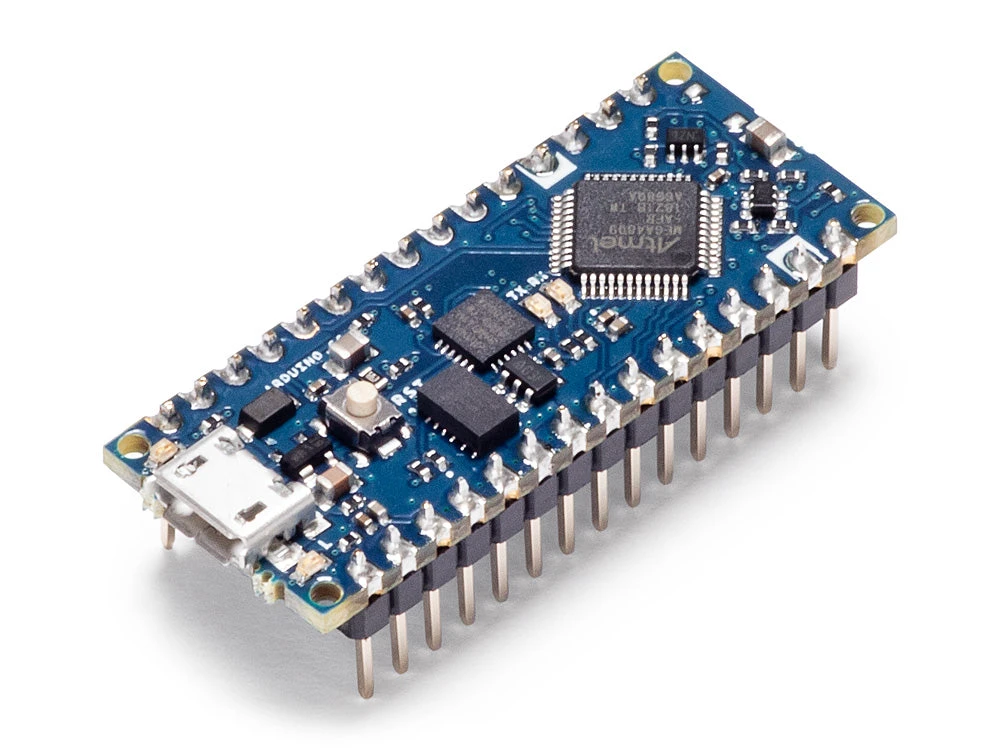
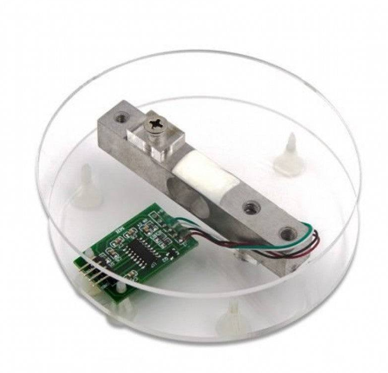
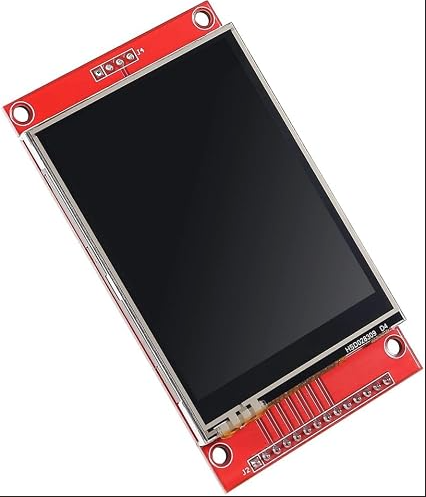

# 243-5P5-ST PLANIFICATION DE PROJETS a26
## Mangeoire Automatique pour Animaux de Compagnie

_François Beaudoin - Charles-Antoine Mailhot - Nicolas Guay_

## *Le projet*

### *contexte*
Dans le but du cours 243-5P5-ST de Planifications de projets, nous devons créer à partir de zéros et

en équipe, un projet technique inspiré pour mettre en pratique la théorie de travail Scrum vue en classe

### *objectif*
l'objectif est de réaliser un projet en appliquant en pratique les techniques de travail vu en classe.

Quelque technique mit en pratique :
- Utilisation des Daily scrums
- Répartition des tâches égales
- Séparations des objectifs par des sprints
- etc.

Dans le cadre de ce cours, le projet contient, à la demande du professeur, les contraintes qui suivent :
- Utiliser un Arduino Nano comme Microcontroleur
- Le module doit être réalisable en imprimante 3D pour pouvoir le reproduire facilement
- Des élèves de première année de la technique doit être en mesure de refaire le code sans difficulté
- Le projet doit contenir au moins un actionneur pour qu'il soit un minimum interactif.

### *Structure générale du dépôt*
la structure générale des documents du projet est divisée en trois parties :
- document image : contient les tous images du projets
- document projet-original : contient les documents et les fiichiers 3D du projet
- document scrum : contient le carnet de produit et les différents sprint à faire pour réaliser le projet.

### *Instructions de démarrage rapide*
Pour prendre en main le projet facilement et le faire par vous même. Vous 

aurez besoins de la liste de pièce suivante et de certaines librairies

##### *liste de pièces primaires :*

- [x] un module Arduino Nano

  

  
- [x] une load cell de minimum 2Kg

  

  
- [x] un écran tactile (ex : LCD TFT 2,8" ILI9341)

 

- [x] un moteur : *à déterminer le type*

##### *liste des librairie à utiliser :*

- [x] Librairie Ili9341 sur arduino
- [x] Librairie hx711 sur arduino
