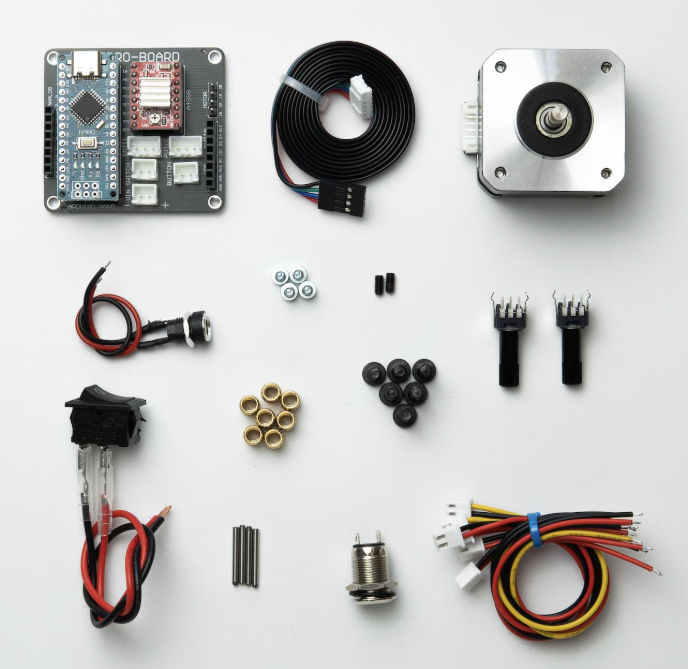

# Explication
Pour effectuer le montage, regarder les videos suivantes

## Montage

- Assemblage du PCB
    - https://www.youtube.com/watch?v=q3L5xcbK_Dc

- Assemblage du boitier
    - https://www.youtube.com/watch?v=HG7u0NaIp4I

## Autres informations
- Explication général
    - https://www.youtube.com/watch?v=Uv0lsih8JRA

## Composants
